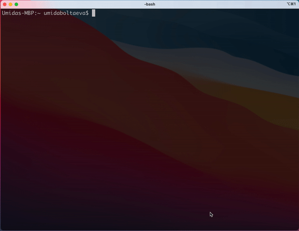
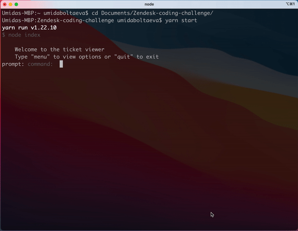
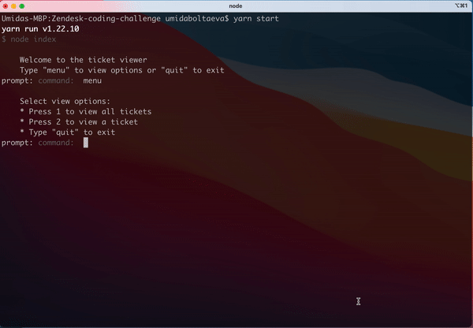
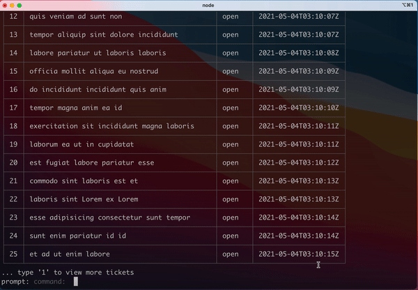
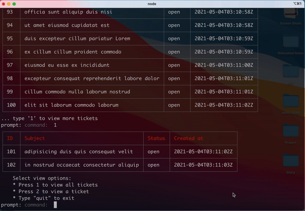
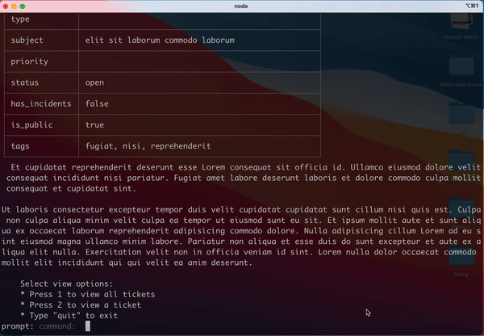

# Zendesk Ticket Viewer (Intern Coding Challenge)

This is a CLI-based ticket viewer app built using Zendesk Ticket API. There are 102 tickets overall and a few options for you to use the app. This Ticket Viewer can:

- connect to the Zendesk API
- request all the tickets for your account
- display them in a list
- display individual ticket details
- page through tickets when more than 25 are returned

I built this app using [MVC](https://medium.com/@ToddZebert/a-walk-through-of-a-simple-javascript-mvc-implementation-c188a69138dc) pattern which means Model-View-Controller. 

The MVC is about a clean cut **separation of concerns.** It’s a design pattern that breaks an application into three parts: the data (Model), the presentation of that data to the user (View), and the actions taken on any user interaction (Controller). 
In other words, a user gives a command. That command is passed to a Controller that controls what should happen next. Often, the Controller requests data from the Model and then gives it to the View, which presents it to the user.

In my code, `api.js` file represents the **Model**. There are 2 functions inside the file which request both all tickets data and a single ticket data from Zendesk server using Zendesk Ticket API. So this file collects data and that's it!

Moreover, all the **View** files are created inside the `view` folder. View files are responsible for delivering a specific message or data according to the command users give to the controller.

Finally, there is a `controller.js` file in the project. As I mentioned above it stands between Model and View and navigates view files taking the required data from the Model.

### Used technologies:

- JavaScript
- Node.js v12.18.0
- yarn 1.22.10

## Installation

To set up the project in your own computer successfully, 
- create `.env` file 
- enter your **username** and **password** in the exact format that shown in `.env.example` file
- open your terminal and type `yarn` to install the necessary packages.

If you follow these steps correctly, then you're done! The project is ready to use now!

## Usage

1. Open your terminal. You must be in the same directory that the project is created at. Type `yarn start` in your terminal to start the project. You will see the welcome message with 2 main instructions:

2. To view the **menu**, type simply `menu`:

3. As is given in the menu, to view all tickets type `1`. You can see 25 tickets in one page:

4. If you want to see more tickets, press `1` again. Every time you give `1` command, you'll get the remaining tickets 25 at a time until the table finishes:

5. To view a single ticket data, type `2` in command line. You will be asked the ID number of the ticket you want to see. Enter a positive digit from **1** to **102** and the ticket data will pop up! Ta-da!

6. To exit just type `quit`:

